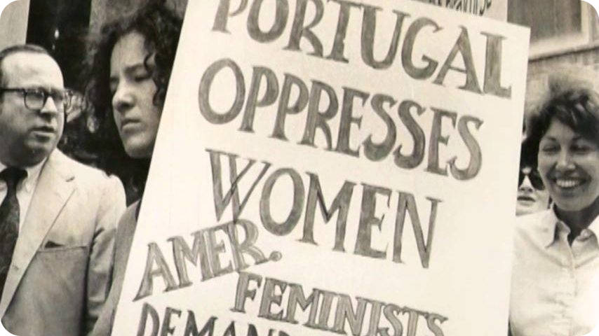

# Direitos das Mulheres em Portugal

**[Link para o website](https://editor.p5js.org/hugomrmonteiro/sketches/RT5sPH4ci)**

## Estudantes
- Hugo Monteiro – 3200345  
- Maria Henriques – 3200732  
- Tomás Guimarães – 3200347

## 

- **Semestre:** 1º
- **Discplina:** Laboratório de Projeto I
- **Licenciatura:** Design Gráfico e Multimédia
- **Universidade:**  Escola Superior de Artes e Design, Caldas da Raínha
- **Professor:** Marco Heleno
- **Último momento de Avaliação:** 14 dezembro de 2022

#  referências
 [Infopedia](https://www.infopedia.pt/apoio/artigos/$historia-dos-direitos-da-mulher)  ●  [Imagem de Referência](https://www.politize.com.br/wp-content/uploads/2022/03/A-Histo%CC%81ria-dos-Direitos-das-Mulheres-3.png)  ●  [Dados Pordata](https://www.pordata.pt/portugal/alunos+matriculados+no+ensino+superior+total+e+por+sexo-1048-8485)  ●  [Tabela de Dados Utilizada](https://github.com/Dryade07/direitosdasmulheres.github.io/blob/main/tabelaDados.csv) 

# conceito
A Relação dos Direitos das Mulheres com a entrada de estudantes do género feminino nas Universidades

Em Portugal, as mulheres deixaram, perante a lei, de dever obediência ao marido em 1910 e, em 1931, puderam votar desde que tivessem um curso secundário ou superior. Só em 1968 obtiveram direitos políticos iguais aos dos homens, e, apenas no ano seguinte, salário equivalente ao masculino. Em 1990 passou a ser proibida a publicidade com discriminação sexual e, nove anos mais tarde, foi criado o Ministério da Igualdade.

No dia 1 de abril de 1978 entrava em vigor o diploma que procedeu à revisão do Código Civil. Esta revisão veio introduzir amplas e profundas alterações no regime jurídico que regulava o direito privado português, sobretudo no domínio específico da família, com os direitos das mulheres a conhecerem grandes progressos, marcados pelo princípio fundamental da igualdade de género.

O decreto-lei da revisão foi promulgado em novembro desse ano, mas entre os intervenientes no processo nunca houvera dúvidas quanto à diferença entre o que a legislação determinava e a sua aplicação efetiva na vida quotidiana. De facto, o deputado Manuel Vilhena de Carvalho, do Partido Social-Democrata, alertara que «seria irrealismo afirmar que toda a sociedade portuguesa vai aceitar, de imediato, as inovações propostas, sem uma dúvida, um receio ou um gesto de resistência.» O próprio ministro Almeida Santos, em entrevista ao Diário de Lisboa pouco tempo depois da entrada em vigor do decreto-lei, declarara que a mudança das mentalidades era um fenómeno lento (15), e, já durante o debate, reconhecera que a revisão era apenas «um primeiro passo» e que a igualdade social não podia ser simplesmente concedida através de legislação.

Lamentavelmente, o futuro viria a confirmar estes prognósticos. Quatro décadas passadas, as mentalidades e as práticas continuam, com frequência, e persistentemente, a não refletir o que as leis indicam - incluindo as que, entretanto, se foram elaborando sobre o assunto - fazendo dos direitos das mulheres, em Portugal, uma causa tão atual e urgente como no final dos anos 70.

A luta pelos direitos das mulheres no mundo e em Portugal continua até aos dias de hoje. Infelizmente, ainda existem práticas no mundo que colocam a mulher abaixo do homem e até mesmo em Portugal. A educação tem de mudar, as mentalidades, as crenças e afins têm que evoluir.

A luta pelos direitos das mulheres não é só delas, é de todos.

O nosso grupo decidiu escolher este tema para criarmos uma ligação entre a evolução dos Direitos das Mulheres e o aumento das oportunidades ao mostrarmos o aumento da entrada das mesmas no ensino superior em Portugal. Poderão visualizar a relação entres estes dados, através da nossa página.

